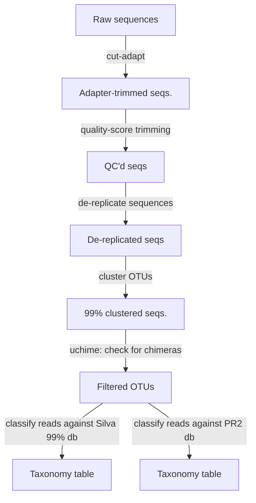

# Qiime2 workflow
## 18S OTU-based
- Import data using a manifest.
- Trim adapters using the cut-adapt plugin:
```
qiime cutadapt trim-paired --i-demultiplexed-sequences G1-18S.qza \
--p-cores 4 --p-front-f ^CAGCAGCCGCGGTAATTCC \
--p-front-r ^CCCGTGTTGAGTCAAATTAAGC --p-discard-untrimmed \
--p-no-indels --p-error-rate 0.2 \
--o-trimmed-sequences G1-18S-adapter-trimmed.qza
```
- Quality control using the q-score plugin:
```
qiime quality-filter q-score --i-demux G1-18S-adapter-trimmed.qza \
 --o-filtered-sequences G1-18S-adapter-trimmed-qc.qza \
 --o-filter-stats qc-stats
```
- De-replicate sequences
```
qiime vsearch dereplicate-sequences \
  --i-sequences G1-18S-adapter-trimmed-qc.qza \
  --o-dereplicated-table G1-18S-table.qza \
  --o-dereplicated-sequences G1-18S-rep-seqs.qza
```
- Perform *de novo* clustering @ 99% similarity:
```
qiime vsearch cluster-features-de-novo \
  --i-table G1-18S-table.qza \
  --i-sequences G1-18S-rep-seqs.qza \
  --p-perc-identity 0.99 \
  --o-clustered-table G1-18S-table-dn-99.qza \
  --o-clustered-sequences G1-18S-rep-seqs-dn-99.qza
```
- Check for chimeric OTUs:
```
qiime vsearch uchime-denovo \
  --i-table G1-18S-table-dn-99.qza \
  --i-sequences G1-18S-rep-seqs-dn-99.qza \
  --output-dir uchime-G1-18S
```
- Now filter out all chimeras and 'borderline' chimeras:
```
qiime feature-table filter-features \
  --i-table G1-18S-table-dn-99.qza \
  --m-metadata-file uchime-G1-18S/nonchimeras.qza \
  --o-filtered-table G1-table-nonchimeric-wo-borderline.qza

//filter the feature table[sequences]

qiime feature-table filter-seqs \
  --i-data G1-18S-rep-seqs-dn-99.qza\
  --m-metadata-file uchime-G1-18S/nonchimeras.qza \
  --o-filtered-data G1-18S-rep-seqs-nonchimeric-wo-borderline.qza
```

- Need to import the Silva database. This involves importing the reference sequences and their taxonomy. The file system is a bit of a mess so here I include the absolute paths in the Silva database download files. 
- I used the Silva 99% clustered 18S only dataset.
SILVA_132_QIIME_release/rep_set/rep_set_18S_only/99/silva_132_99_18S.fna
SILVA_132_QIIME_release/taxonomy/18S_only/99/consensus_taxonomy_all_levels.txt

- Import the database reads:
```
qiime tools import \
  --type 'FeatureData[Sequence]' \
  --input-path SILVA_132_QIIME_release/rep_set/rep_set_18S_only/99/silva_132_99_18S.fna\
  --output-path silva99.qza
```
- Import associated taxonomy:
```
qiime tools import \
  --type 'FeatureData[Taxonomy]' \
  --input-format HeaderlessTSVTaxonomyFormat \
  --input-path SILVA_132_QIIME_release/taxonomy/18S_only/99/consensus_taxonomy_all_levels.txt \
  --output-path silva99-tax.qza
```
- Classify against the Silva database:
```
qiime feature-classifier classify-consensus-vsearch \ 
--i-reference-reads silva99.qza \ 
--i-reference-taxonomy silva99-tax.qza \
--i-query G1-18S-rep-seqs-nonchimeric-wo-borderline.qza \ 
--p-threads 10 \
--o-classification g1-taxonomy.qza
```
Compared to the classify-sklearn option, this vsearch classification is much less memory intensive and effectively uses multithreading. This is an LCA-based approach.

- Follow the same classification approach, but with PR2.
```
qiime tools import \
  --type 'FeatureData[Sequence]' \
  --input-path pr2_version_4.12.0_18S_mothur.fasta\
  --output-path pr2-mothur.qza

qiime tools import \
  --type 'FeatureData[Taxonomy]' \
  --input-format HeaderlessTSVTaxonomyFormat \
  --input-path pr2_version_4.12.0_18S_mothur.tax \
  --output-path pr2-tax.qza
```
- Classify with vsearch:
```
qiime feature-classifier classify-consensus-vsearch \ 
--i-reference-reads pr2-mothur.qza \ 
--i-reference-taxonomy pr2-tax.qza \
--i-query ../SilvaOTU/G1-18S-rep-seqs-nonchimeric-wo-borderline.qza \ 
--p-threads 6 \
--o-classification g1-taxonomy-pr2.qza
```
### High-level overview


## 18S DADA2
- DADA2 requires that we choose a truncation length. So we need to check at what length on average sequence quality degrades for fwd and rev reads.

As Johanna had mentioned in the past, our reads don't overlap so DADA2 has a major problem. When we look at the filtering statistics we drop 2 orders of magnitude in number of sequences when filtering because the reads don't merge.

One of the creators of DADA2 suggests using only the forward reads in this case. ([https://github.com/benjjneb/dada2/issues/790](https://github.com/benjjneb/dada2/issues/790))

- Import forward reads as single-end reads.
```
qiime tools import \
  --type 'SampleData[SequencesWithQuality]' \
  --input-path Gradients1-18S-manifest-dada2.txt \
  --output-path g1-18S-fwd.qza \
  --input-format SingleEndFastqManifestPhred33V2
```
- Use cutadapt to get rid of adapters:
```
qiime cutadapt trim-single --i-demultiplexed-sequences g1-18S-fwd.qza \
--p-cores 6 --p-front ^CAGCAGCCGCGGTAATTCC \
--p-discard-untrimmed \
--p-no-indels --p-error-rate 0.2 \
--o-trimmed-sequences g1-18S-fwd-adapter-trimmed.qza
```
This removed about 9% of total sequence when I ran it.
- Check read quality!
```
qiime demux summarize \
  --i-data g1-18S-fwd-adapter-trimmed.qza \
  --o-visualization demux.qzv
```
Looking at read quality, it's very high until about 220 bp in the fwd reads.
- Using our newfound info on sequence quality we use dada2 to get ASVs. (Use as many CPU cores as you can here.)
```
nohup qiime dada2 denoise-single \
  --i-demultiplexed-seqs g1-18S-fwd-adapter-trimmed.qza \
  --p-trunc-len 220 \
  --p-n-threads 2 \
  --o-representative-sequences g1-rep-seqs-dada2.qza \
  --o-table g1-table-dada2.qza \
  --o-denoising-stats g1-stats-dada2.qza &
  ```
  - Let's look at the denoising stats and hopefully nothing crazy happened:
  ```
qiime  metadata  tabulate \
--m-input-file  g1-stats-dada2.qza \ 
--o-visualization  stats-dada2.qzv 
```
 - Looks pretty good. On average we kept about 80% of reads.
 - So let's try to classify these ASVs with PR2 and Silva using vsearch again:
 ```
 qiime feature-classifier classify-consensus-vsearch \ 
--i-reference-reads ../SilvaOTU/silva99.qza \ 
--i-reference-taxonomy ../SilvaOTU/silva99-tax.qza \
--i-query g1-rep-seqs-dada2.qza\ 
--p-threads 2 \
--o-classification silva/g1-taxonomy-silva-dada2.qza
```
This run was considerably faster than the OTU-based search. 
- The same as above but with PR2!


## Follow-up filtering for all samples
- Remove samples with < 10,000 sequences. (63693, 63837, 64041) One of these is our mystery 'unassigned' sample. 
- Filter out metazoan reads.
- Filter very rare ASVs/OTUs. (Abundance of ASV is < 10 summed across all samples)

<!--stackedit_data:
eyJoaXN0b3J5IjpbODY0NDM3OTMyLDE4MTY4NDM4MjAsLTY1OT
AzODUyMSwtMTUyODE3NDI1OSwtMTk4NTgxMDUwLC0yMDI3NzM5
MzA4LC0xMDc4MDgxNjI2LDE1MDAwNzM4MjEsMjQyMTE0MDczLD
E1MzUzMjA5NSwtMTg0MDc0MzMzOSwtMTE4MDk0MjY4NSwxMjg1
NjM2NzQwLC00OTI3OTQwMzYsLTE4Mjg1NDI2MzUsOTk0OTg2MT
ksLTE4MjM3NDM1MzcsLTExMzkwNDE2NjAsLTU0MjY0NTMwLC01
NTA5MjcxMDFdfQ==
-->
